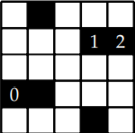
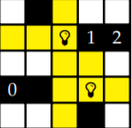
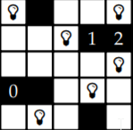

# LIGHT-UP AKARI PUZZLE

You have a grid, in our case always n × n, with white and black cells. The
goal is to place light bulbs in white cells so that all white cells are lit. A light
bulb illuminates all white cells visible horizontally and vertically, but all black
cells (walls) block light. Moreover, no light bulb is allowed to illuminate another 
light bulb (but more light bulbs may illuminate a cell). Black cells may
contain a number (0, 1, 2, 3, or 4) that specifies the exact number of light bulbs
occurring in the adjacent cells (diagonal neighbors do not count).
For example, if we have the following assignment,

            

we may place two light bulbs as follows.

            

They illuminate the yellow cells; one of the cells is illuminated by both light
bulbs. By adding more light bulbs, we obtain the only possible solution:

            


#Input 
An input is a string of length n × n. In our example, it is

        WWWBW0BWWWWWWWWWWW12WBWWW

where W is a white cell, B is a black cell without a number, and 0. . . 4 are black
cells containing the corresponding number. 
A cell (x, y) is described by a character at the position (n · y) + x in the string, we start counting from zero.

#Output 

The output of your solver is the string you receive on the input where your
placement of light bulbs is indicated by replacing the corresponding Ws by Ls.
Hence the correct output for our example is

        WLWBW0BWLWWWWWLWWL12LBWWL
        
If no solution is possible, then it produce string
                    0

Example: 
```
WWWBW0BWWWWWWWWWWW12WBWWW
```

```
WLWBW0BWLWWWWWLWWL12LBWWL
--- 3.9048542976379395 seconds ---
```
